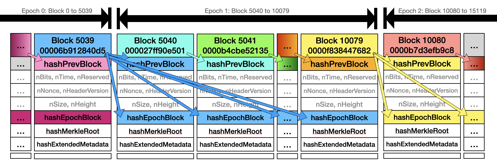
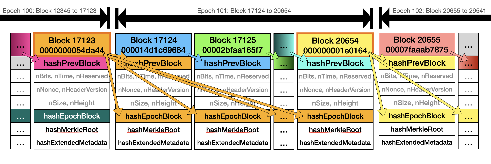
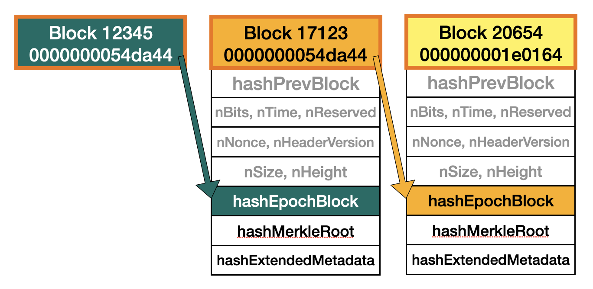

# Summary
In essence, this turns "very lucky" blocks into Epoch Blocks, instead of rolling over unconditionally every 5040 blocks.

Lotus has a field in the block header called `hashEpochBlock`, which contains the hash of the current "Epoch Block". An Epoch Block concludes an Epoch, and then all following blocks reference that Epoch Block, until a new Epoch starts. That means, all blocks within an Epoch have the same Epoch Block Hash.

This upgrade changes the definition of "Epoch Block":
1. Currently, Epochs are always exactly 5040 blocks long and the last block of the Epoch becomes the Epoch Block.
2. After the upgrade, a new Epoch starts if a block has been found that has a hash below `target/5040`.

In other words, a new Epoch now starts when a block undershoots the required target by a factor of 5040. On average, this happens once every 5040 blocks, so the average epoch length before and after the upgrade will remain the same.

Note: Miners will not get any additional reward for finding such a block. It is a consensus rule change in the header structure that miners will have follow in order for their blocks to be accepted. It therefore does not need to be rewarded.

## Old Mechanism


Above the old epoch hash mechanism. Values which are the same have the same color. Epochs are exactly 5040 blocks long. The block at the end of the epoch becomes the `hashEpochBlock` for all blocks of the following epoch.

## New Mechanism


Above the new epoch hash mechanism. Values which are the same have the same color. Lucky blocks have a bold gold border. Epochs don't have a fixed length, but on average are 5040 blocks long. A block with a lucky hash becomes the `hashEpochBlock` for all following blocks until (and including) a block has a lucky hash again.

# Motivation
Currently, blocks that undershoot the target by a large amount are no different than blocks that just barely hit the mark. All of this "extra work" that just happened by pure chance is currently wasted.

However, we can put blocks that happen to provide much more work than necessary to good use.

This is because after this change, finding blocks will be no harder than before, but trying to fake an Epoch Block will require 5040 as much proof of work than trying to fake a normal block.

This is useful for various applications:
- More efficient SPV (ESPV)
- Very low power devices
- Cross-chain smart contracts

## More efficient SPV (ESPV)


Epoch blocks form a chain (through `hashEpochBlock` instead of `hashPrevBlock`). The new epoch mechanism allows for a very efficient variant of Simplified Payment Verification, by only keeping a chain of epoch blocks, instead of all blocks. Combined with the Epoch Merkle Root (specified elsewhere), wallets that only receive a few transactions every now and then can only download the epoch blocks and Merkle proofs of their transactions for the Epoch Merkle Roots of the epoch blocks, instead of normal Merkle proofs for the `hashMerkleRoot` of all the individual blocks.

## Very low power devices
A low-power chip, e.g. on a smart card, could very easily verify that a transaction has been buried by certain amount of PoW. It would require another change the Epoch Merkle Root to function well, which is specified elsewhere.

This could be useful for e.g. cash cards, which store a certain amount of Lotus on them, and can provide a very compact proof that the card knows about the coins (requires trusting the issuer of the cards to upload the correct code):
1. User initiates the "Load Lotus onto card" process with the card. This allocates space on the card and generates a random and sealed private key.
2. Cash Card derives the public key of the just generated private key, and exposes it to the User. It also signs the public key with the card issuer's private key and sends the signature over, too.
3. The user sends funds to the public key and waits until it has accumulated sufficient PoW (e.g. waiting for an Epoch Block Hash). Generally, the PoW should be far above the value of the coins that are to be uploaded, to make PoW attacks non-viable.
4. The user then can easily prove to the card that the transaction is buried beneath sufficient PoW.
5. The proof is uploaded and verified by the card.
6. Later, the Point-Of-Sale system sends over a nonce to the card which is then signed by the private key.
7. The card sends over that signature, the transaction and the PoW uploaded before, as well as the card issuer's signature.
8. The Point-Of-Sale can verify all of that without access to the internet (given they trust the card issuer's public key), and the merchant can take the cards as payment.
9. Later, a user can initiate withdrawal from the card. As a simple solution, the private key is exposed and deleted from the card, such that no proofs are sent over anymore.

For small amounts, the verification at 8. could be done without ever seeing the blockchain, but for anything above that, access to (at least) the Epoch Block headers has to be available to prevent someone from faking PoW for massive amounts of cards. Since this (on average) is far below 1kB of data *per week*, even during a complete blackout, transmitting this kind of data should be possible (e.g. through a network of LoRa radio, or sharing punchcards around).

The Cash Card setup could also be extended to fully-offline payment cards, where cards that have a shared trusted card issuer can establish encrypted channels and send coins between cards, which would have useful applications in areas with low internet connectivity or during an internet blackout.

## Cross-chain smart contracts
A smart contract could verify something similar in order to allow cross-chain integration.

This could be useful for e.g. wrapping BCH, XEC or similar as a Lotus token (Lotus tokens using inductive token proofs aren't specified yet but are theoretically possible):
1. Minter wants to generate some lBCH on Lotus. They generate a placeholder UTXO on Lotus through a smart contract (this one "throttles" the amount of BCH that can be locked up to less than the amount of PoW done on BCH).
2. Minter locks up BCH into a special kind of smart contract, which references the placeholder UTXO on Lotus.
3. Minter waits for sufficient confirmations on BCH (order of 10-20 confirmations).
4. Minter provides the following data to the MINT baton on Lotus, which is locked in a smart contract, which verifies the provided data:
    1. The PoW (chain of blockheaders) of 3.
    2. The Merkle path of the transaction done in 2.
    3. An output to send the new lBCH tokens to (on Lotus).
5. Minter can use the lBCH tokens right away without waiting for confirmations.
6. Later, Redeemer has some lBCH tokens they want to redeem for BCH. They burn the lBCH together with the placeholder UTXO (which requires burning lBCH in order to be spent).
7. Redeemer waits for sufficient confirmations on Lotus (order of 1-2 Epoch Blocks).
8. Redeemer provides the following to the smart contract of the UTXO created in 2.:
    1. The PoW (chain of Epoch Block Headers) of 7.
    2. The Merkle path of the transaction done in 6. to the Epoch Merkle Root.
    3. An output to send the BCH to.
9. Redeemer can use the BCH right away without having to wait for confirmations.

The above setup still has a few attack vectors which can be mitigated with additional measures, but this is part of future work.

# Specification
`EPOCH_NUM_BLOCKS` shall be 5040 blocks.

"Epoch Target" shall be defined as follows:
1. Take the block's `nBits` and split them into `nSize = nBits >> 24` and `nWord = nBits & 0x007fffff`.
2. `nWordEpoch`: Multiply `nWord` by 256, and then divide it by `EPOCH_NUM_BLOCKS` (rounding down).
3. `nSizeEpoch`: Decrement `nSize`.
4. Re-assemble `nBitsEpoch = (nSizeEpoch << 24) | nWordEpoch`.
5. "Epoch Target" is the target from the compact `nBitsEpoch`.

We do this calculation on the compact 32-bit integers instead of on the 256-bit target such that low-power devices and smart contracts don't have to do 256-bit arithmetic. Multiplying `nWord` by 256 and decrementing `nSize` is to preserve precision of the computation.

A block header has an Epoch Block Hash if its hash is below or equal to the Epoch Target. Equivalent C++ code:
```cpp
bool IsEpochBlockHash(const BlockHash &hash, const uint32_t nBits) {
    bool fNegative;
    bool fOverflow;
    arith_uint256 bnTarget;

    const uint32_t nSize = nBits >> 24;
    const uint32_t nWord = nBits & 0x007f'ffff;

    assert(EPOCH_NUM_BLOCKS > 0x100); // otherwise we might build invalid nWord
    // Shift by 8 first to retain some precision, ...
    const uint32_t nWordEpoch = (nWord << 8) / EPOCH_NUM_BLOCKS;
    // ... and adjust nSize accordingly.
    const uint32_t nSizeEpoch = nSize - 1;
    // Build new epoch nBits.
    const uint32_t nBitsEpoch = (nSizeEpoch << 24) | nWordEpoch;

    bnTarget.SetCompact(nBitsEpoch, &fNegative, &fOverflow);

    // Check if proof of work is sufficient to be an epoch hash
    return UintToArith256(hash) <= bnTarget;
}
```

Note: `nBitsEpoch` occasionally is non-canonical (e.g. when `nBits` is `0x1c008000`, `nBitsEpoch` is `0x1b000680` whereas `0x1a068000` would be canonical), but this is just an internal representation and therefore doesn't have to be canonical.

A block shall be considered Epoch Block if:
1. If the Leviticus upgrade did not activate yet, it is considered an Epoch Block if (and only if) `(height + 1) % EPOCH_NUM_BLOCKS == 0`.
2. If the Leviticus did activate, it is considered an Epoch Block if (and only if) the block's hash is below the Epoch Target.

The field `hashEpochBlock` of a block must be set to the following, otherwise the block shall be deemed invalid:
1. If the previous block is an Epoch Block, it must be set to the previous block's hash.
2. If the previous block is not an Epoch Block, it must be set to the previous block's `hashEpochBlock`.
