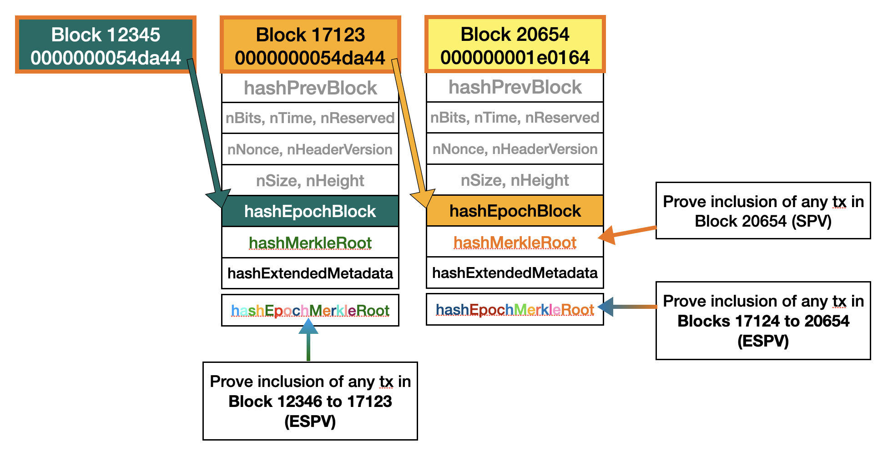
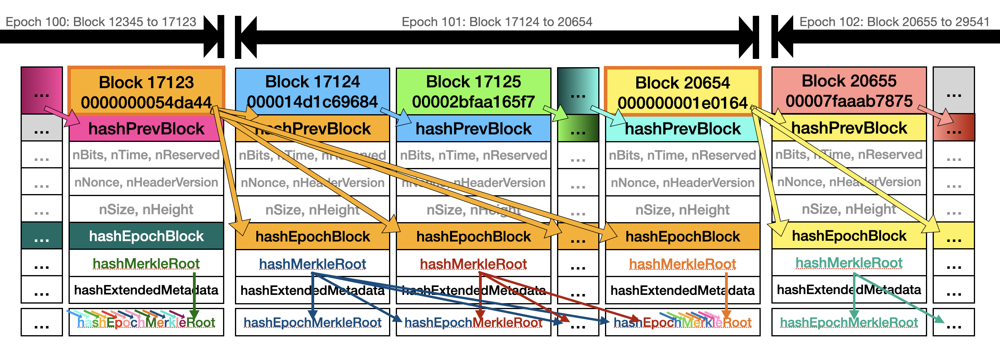

# Summary
This change will allow proving the inclusion of any transaction in a given epoch, with the same level of security than SPV, solely from the header of the Epoch Block, together with the block's extended metadata and a merkle proof for the transaction for `hashEpochMerkleRoot`.

A new Extended Metadata field `hashEpochMerkleRoot` is added, and required to be present in every block after the activation. This field is the Merkle root of all epoch Merkle leaves of all the blocks of the current epoch, where a epoch Merkle leaf is `H(block hash || block merkle root)`. The block hash is set to all zeros for the block itself.

See the [5040xPoW Epoch Block](2022-06-21-5040xpow-epoch-hash.md) specification for the definition of epoch and Epoch Block.

## ESPV

Ultra light clients would only store a chain of headers of Epoch Blocks, instead of the full header chain. Using the Epoch Merkle Root, it can be proven to an ultra light client that a particular transaction is part of the blockchain.

In the diagram above, the client knows headers of block 20654 and block 17123 (but none of the blocks in between), and can verify that they form a chain through the `hashEpochBlock` field. They also verify that both have 5040 times more PoW than is required in the target.

Using the `hashMerkleRoot` of block 20654, the client can only verify that a transaction occured in block 20654. But using `hashEpochMerkleRoot`, it's able to verify inclusion of any transaction that occured in blocks 20654 down to block 17124.

The diagram above shows the entire mechanism. Values which are the same have the same background color.

1. Blocks form a chain: block hashes are referenced in `hashPrevBlock` (small arrows)
2. Epochs are indicated by the large black bold arrows on top.
3. A lucky block hash becomes an epoch block (gold border), all following blocks have that `hashEpochBlock`, until (and including) a new epoch block is found (fan of arrows from the epoch blocks).
4. Every block has its own `hashMerkleRoot` and `hashEpochMerkleRoot`
    1. At the beginning of an epoch, the `hashEpochMerkleRoot` is just `H(BlockHash || hashMerkleRoot)`.
    2. One block later, it's the Merkle root of the two `hashMerkleRoot` of the first two blocks of the epoch (hence the blue/red split).
    3. At the end of the epoch, the `hashEpochMerkleRoot` is the Merkle root of all `H(BlockHash || hashMerkleRoot)` of the entire epoch, including the epoch block (the small colorful arrows in the middle indicate that a lot of other `hashMerkleRoot` than those two form the `hashEpochMerkleRoot`).

# Motivation

Motivation for this change can be found in the [5040xPoW Epoch Block](2022-06-21-5040xpow-epoch-hash.md#motivation) specification.

# Specification
The specification references definitions from the [5040xPoW Epoch Block](2022-06-21-5040xpow-epoch-hash.md#specification) specification.

The `hashEpochMerkleRoot` for a given block is defined as follows:
1. Walk back the chain, and start at the first block of the epoch. Blocks have the same epoch if (and only if) they have the same `hashEpochBlock`.
2. In block height order (ascendingly), collect the `hashMerkleLeaves`. Each leaf is the `H(BlockHash || hashMerkleRoot)` for each of the blocks of that epoch, including the given block itself. However, set `BlockHash` to all zeros for the block itself.
3. Build a Merkle tree of the `hashMerkleLeaves`, by repeatedly pairing them up, and hashing the concaternation of both (using double SHA256), until only a single hash remains. If hashes don't pair up evenly for a layer, add a hash that's all 0 to make the number of hashes even. This is the exact same algorithm used by `hashMerkleRoot`, so Merkle proofs for transactions will have a seemless transition from tree of Merkle roots to tree of transactions.
4. Calculate the height of that merkle tree. For a single hash, it is 1, and is incremented by 1 for every additional layer of the merkle tree.
4. `hashEpochMerkleRoot` shall be the root of that Merkle tree, with the height of that tree appended as a single byte (note: the tree height will always fit in a single byte).

This specification introduces a new extended metadata field. The `vMetadata` field of a block must be set to the following:
1. If the Leviticus upgrade did not activate yet, `vMetadata` must be an empty array.
2. If the Leviticus did activate, it must have exactly one entry: It's `fieldId` must be set to 1, and its data must be set to `hashEpochMerkleRoot`.

The `hashExtendedMetadata` field must be updated correspondingly to the double SHA256 of the serialization of `vMetadata`.

# Discussion
## Why H(block hash || merkle root) as leaves?
We choose this definition as leaves so seamless Merkle proofs are possible from `hashEpochMerkleRoot` directly to individual transactions. However, it is also often very important to know the block timestamp of a transaction, in this case, knowing the block hash is necessary.

This solution offers both pieces of data, at the cost of increasing every Merkle proof by one element. While not optimal for some use-cases, it's a good trade-off that allows for as many use-cases as possible for minimal overhead.

## Why add the tree height byte?
There are no known attacks (all attacks we could come up with are impossible for other reasons), there could be some cryptographic construction that abuses the construction of the Merkle tree to fake the inclusion of a transaction which has been overlooked. Therefore, it is always more secure to have this byte covered by 5040x PoW and allow clients to rely on it than to hope that no attacks are possible.

So while the tree height byte is not strictly necessary, it makes many checks by clients a lot simpler and reliable by having this piece of data covered by PoW, and since the cost is just a single byte, we choose to add it.

## Why set the block hash to 0 for the block itself?
We could instead require to have the unsolved block hash (e.g. set the nonce to zero), and to set e.g. the `hashExtendedMetadata` to 0, or just the `hashEpochMerkleRoot`. It is not obvious which fields will have to be voided like this in the future, and we might actually bar some future changes by doing it like this.

Also, this would make mining software even more complicated than this change already requires.

Instead, we just set the hash to 0. If a client encounters a block hash in `hashEpochMerkleRoot` which is 0 (which is computationally impossible to fake), it will instead just switch over to analyzing the epoch block header itself. This is acceptable complexity for client code.

## Alternatives
### Tree of just block hashes
Instead of building a tree of `H(block hash || merkle root)`, we can build a tree of block hashes instead. This would allow clients to require one less element of Merkle proofs and therefore would be more efficient.

However, this has the obvious flaw that the block can't contain its own hash, so proofs for txs within the epoch block itself would have to switch over to `hashMerkleRoot` of the epoch block, making client code messy.

Second, it doesn't allow just a simple long merkle path into `hashEpochMerkleRoot`, making client code that doesn't rely on block hashes messy.

### Tree of just merkle roots
Instead of building a tree of `H(block hash || merkle root)`, we can build a tree of just the merkle roots. This again would allow clients to require one less element of Merkle proofs and therefore would be more efficient.

However, all transactions within `hashEpochMerkleRoot` would then be timestamped only by the epoch block, removing potentially useful data within the individual block headers.

For instance, a ESPV client could use the timestamp field of a block header within `hashEpochMerkleRoot`, and display that timestamp for transactions within that block.

## Interaction with mining software
It is advised that mining software switches over to only use `getrawunsolvedblock`, which will fill-in the correct `hashEpochMerkleRoot` already.

Using `getblocktemplate`, one has to compute `hashEpochMerkleRoot` oneself, which requires knowing the `hashMerkleRoot` of the current epoch.

## Interaction with Merklix trees
One future change for Lotus (and eCash) will be to switch over to Merklix trees (see [Deadalnix's blogpost on this](https://www.deadalnix.me/2016/09/24/introducing-merklix-tree-as-an-unordered-merkle-tree-on-steroid/)).

One important feature is to allow for exclusion proofs:
> Because the position of an element in the tree is known, it is possible to produce a proof of absence, producing the path in the tree that would lead to element if it was in, but do not. Merkle tree on the other hand, can only prove that element is or isn’t at a given position, not in the whole set.

One such use-case is sharding; a node can prove to another node that a UTXO is invalid, by proving it is not part of a given block.

This is not terribly important for the `hashEpochMerkleRoot`, but we could extend exclusion proofs to whole epoch blocks. In this case, a block would prove the path to a specific block height, and then prove that a specific transaction is not in that place.

Since the block height is already part of the block header, we could actually order epoch merkle leaves in whichever order we want.

However, if we order them by block height (as proposed in this specification), we can verify a merkle path points to a specific index (by treating the Left/Right indicators of a Merkle path as binary number), and therefore don't need to inspect the block header within `hashEpochMerkleRoot` to build an exclusion proof.

Therefore, it seems like the most sensible choice to order epoch Merkle leaves by block height, even once we switch to Merklix trees.
